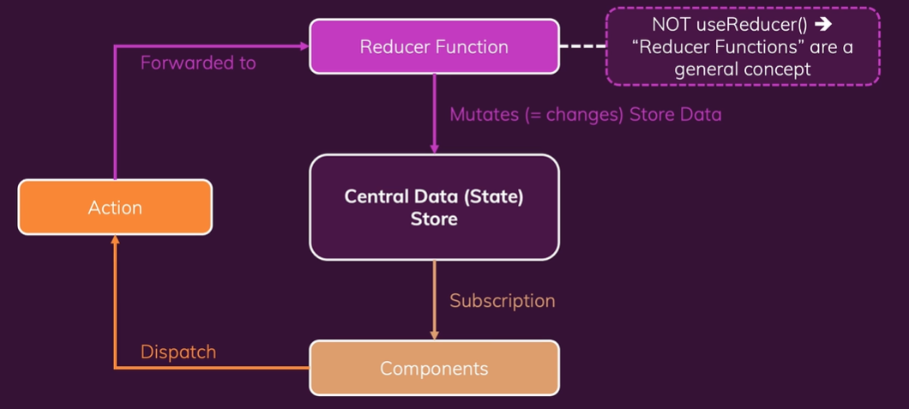
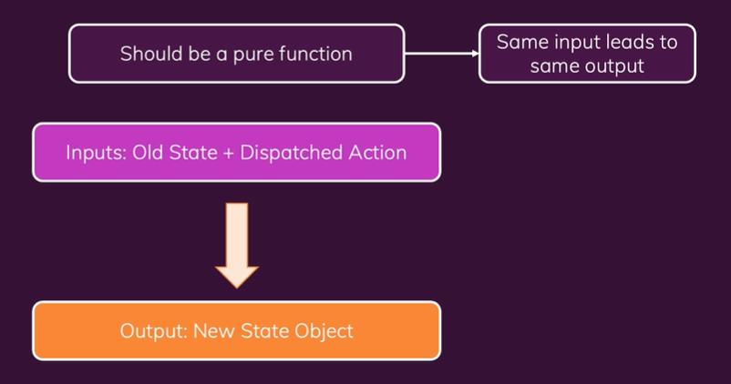

# react--hooks-router-redux

## Čo je React?

- je to JS open-source knihovna od spoločnosti `Facebook` pre tvorbu uživateľského rozhrania (UI).

## Čo je Redux?

Redux je manžment, kt. riadí system stavov naprieč komponenntamy alebo stav celej aplikácie.

Pomáha nám teda spravovať stav, údaje, kt. sa menia a ovplyvňuju našu aplikáciu a čo zobrazujeme na obrazovke.

### Local State

- je stav , teda údaj, kt. sa mení a ovplyvňuje DUI, kt. patri jedenj zložke.
  napr. ak na vstup použivatela a na uloženie vstupu použijeme `useState` pri každom stlačení klávesi v stanoenej premmenej...

- stav patriaci jednej komponente

### Cross-Component State

Stav, kt. ovplyvňuje nie iba jednu komponentu ale viac komponent.
napr. ak mam tlačidlo, kt. otvára alebo zatvara modal a prekrytie ovplynuje viacero komponnet. Modal može byť uzavretý kliknutim na btn vo vnutri toho modalu. Takže potom musia spolupracovat viacero komponent na zobrazovani a skryvani modalu či overlayu.

### App-Wide State

Stav, kt. ovplyvňuje všetky súčasti aplikácie.
napr. použivatelske autentifikácia, ak sa uživatel prihlasi tak sa zmeni navigacia, možu s pridať možnosti, iconky...

### Prečo Redux a prečo React Context?

V projektoch sa može využivať obe súbežne.
React Context ma niekoľko potenciálnych nevýhod.

Jednou z potenciálnych nevýod je, že s React Context možno mať veľmi zložité nastovanie a riadenie stavov, pretože by sme mohli skončiť s hlboko vnoreným kódom JSX a veľa rôznych poskytovateľov kontextu ba aj s jednym obrovským poskitovateľom kontextu, kt. nie je udržatelné.
Všetko záleží na druhu aplíkacie.
Ďaľšou potenciálnou nevýhodou môže byť výkon. Contex je vhodný pre nizkofrekvenčné aktualizácie, napr. zmena témy, autentifikácia.. ale nie ak sa veľmi údaje menia.  
Potom je vhodnejší Redux tzv. tok ako knižnica riadenia stavov.

### Ako funguje Redux?

Redux je jedno centralne uložisko v tvojej aplikácii.
**Komponenty NIKDY nemanipuluju priamo s datovym uložiskom.**
Namiesto toho sa používa `Reducer` funkcia.



1. funkcia `reducer` je zodpovedná za aktulálizáciu údajov v úložisku
2. komponenty sa prihlasia na odber týchto údajov
3. nasledne sa komponnety spájaju s reducer funkciou pomocou `trigger` spúšťačov, ktore zasielaju nejaku akciu
4. `Action` su jednoduchym objektom v JS, kt. popisujú operácie
5. potom tieto akcie sú odovzdávané do reduktora `reducer` funkcie
6. `reducer` robi to čo akcie chcú
7. nasledne `reducer` vypľuje nový stav, ktorý sa uloži do centrálneho úložiska

#### Funkcia `reducer`

- je zodpovedna za zmeny dat v uložisku

```js
const reducer = (state, action) => newState
```

- vo všeobecnosti je to funkcia, kt. prijma nejaky vstup, nasledne ho transformuje tzv. zreduje, zjednoduši a vrati..  
  POZOR: to nie je `useReducer` hook, to je všeobecná koncepcia

```js
function init(initialCount) {
  return {count: initialCount};
}

function reducer(state, action) {
  switch (action.type) {
    case 'increment':
      return {count: state.count + 1};
    case 'decrement':
      return {count: state.count - 1};
    case 'reset':
      return init(action, playload: initialCount);
    default:
      throw new Error();
  }
}
```

### Ako rozbehat projekt s Reduxom?

- tymto prikazom nainicializuješ projekt

```
npm init -y
```

- príkaz pre inštaláciu reduxu a inicializaciu
- vygeneruju sa node_modules, package-lock.json, zavislosti

```
npm install redux
```

1. Do JS priečinku si musiš importnúť redux.

```js
const redux = require('redux')
```

2. Teraz pomocou importovaneho objektu `redux` vytvoríš úložisko, použiješ metódu `createStore()`

```js
redux.createStore()
```

3. Nasledne musíš vytvorit `reducer` funkciu, čo je síce štandartna JS funkcia ale keďže bude volané pre Redux knižniču musí obsahovať dva vstupné parametre, starý alebo existujúci stav a akciu, kt bola poslana.
   A potom musí vrátiť nový stav objeku.
   

```js
const counterReducer = (state, action) => {
	return {
		counter: state.counter + 1,
	}
}
```

4. Uložisku musíš dať vedieť aká reducer funkcia je zodpovedná za zmeny

```js
const store = redux.createStore(counterReducer)
```

5. Teraz potrebuješ niekoho kto to schváli a akciu, kt je možné odoslať, na to vytvoríš dalšiu funkciu.
   Funkcia bude obsahovat `getState()` metódu, kt. je dostupna vďaka `createStore()` metóde a jej úlohou je aktualizovať stav, takže v našom prípade sa metóda `counterSubscriber` zavolá, vždy keď sa zmení stav

```js
const counterSubscriber = () => {
	store.getState()
}
```

6. Funkciu `counterSubscriber` bude volaná iba ak o nej Redux vie. Teda zavolaš uložisko vytiahneš z neho metódu `subscribe()` a do nej zavoláš funkciu.
   `subscribe()` metoda očakáva funkciu, kt. Redux vykoná vždy, keď zmenia údaje.

7. Na overenie funkčnosti a teda na spustenie použi príkaz:

```
node namefile.js
```

8. Teraz už len musíš odoslať akciu pomocou metody `dispatch()`, kde definuješ objekt JS s vlastnosťou `type`, kt. funguje ako identifikátor. Typicky sa tu použiva `string`, kt je unikátny a odlišuje rôzne akcie, ktoré su v reducer funkcii.

```js
store.dispatch({ type: 'increment' })
```

9. Cieľom Reduxu je vytvárať logiku a teda rôzne akcie vo vnútry `reducer` funkcie. Preto si ako druhý argument definoval akciu. Získaš aktuálny stav a potom akciu, kt bol odoslaný teda spustil reducer funkciu. A preto sa v `reducer` možem pozrieť na tú akciu, skontrolovať či `action.type` je rovní príslušnému stringu.

```js
if (action.type === 'increment') {
	return {
		counter: state.counter + 1,
	}
}
```

Ak sa volany type nenachadza v reducer funkcii tak mozem vraciat neznami stav.

```js
if (action.type === 'increment') {
	return {
		counter: state.counter + 1,
	}
}

return state
```

A takto viem pridávať viacero akcii do reduce funkcie, kt musia byt volane pomoocu dispatch metody:

```js
if (action.type === 'decrement') {
	return {
		counter: state.counter - 1,
	}
}
// ------------------------------------
store.dispatch({ type: 'decrement' })
```

## React s Reduxom

Stiahni si predpripravenú a nainštaluj zavislosti [appku](./section18/sources/01-starting-project.zip)

```
npm i
```

Na prácu s Reduxom je nutné si nainštalovať `Redux` baliček a na uľahčenie práce s Reduxom v React aplikáciach je dobre použiť balíček `react-redux`. [react-redux](https://react-redux.js.org/)
Tento balíček umožňuje pripojenie reaktovských aplikácii do Redux úložiska veľmi jednoducho.

```
npm install redux
```

```
npm install react-redux
```

### Postup tvorby react aplikáciou napojenou na redux (expamle1)

1. Vytvor si súbor s nazvom `store` do ktorého vytvoríš priečinok `index.js`
   Bude obsahovať:

- importovať metódu `createStore`, uložiť do konštanty, zavolať a default exportovať
- vytvoriť `reducer` funkciu

2. Do súboru .js kde je vykreslená celá aplikácia, importuj `Provider` z `react-redux` balíčka a obal aplikáciu týmto providerom.

```js
import { Provider } from 'react-redux'
```

POZNAMKA: nemusíš používať tohto providera na najvyššej úrovni, možeš ho použiť jednotlivo na komponentách ktoré vyžaduju prístup do Redux úložiska, všetko záleži na type aplikácii.

React-redux nevie že tento datový súbor uchováva tvoje úložisko. Preto musíš importovať svoje úložisko a vložiť ho ako hodnotu pre prop Providera.

```js
...
import store from './store/index';

ReactDOM.render(<Provider store={store}><App /></Provider>, document.getElementById('root'));
```

3. Pre používanie Reduxu v react komponentách musiš dať komponentám vedieť o reduxe. Importneš si `useSelector` hook z `react-redux` balíčku.

```js
import { useSelector } from 'react-redux'
```

POZNAMKA č.1: možeš použiť aj `useStore` hook, kt. nám tiež umožní priamy prístup do úložiska ale `useSelector` ti umožňuje automaticky vybrať časť zo stavu ovládaného úložiska.

POZNAMKA č.2: ak by si používal classovu komponentu a nie funkcionálnu, tak potom existuje aj funkcia `connect`, kt. možeš použiť namiesto hooku.

```js
import { connect } from 'react-redux'
```

`useSelector` hook umožňuje extrahovať údaje zo stavu úložiska Redux pomocou funkcie.

```js
const counter = useSelector(state => state.counter)
```

4. Pre odosielaia akcií sa využíva `useDispatch` hook, do ktoreho vkladam objekt s argumentom type.

```js
import { useDispatch } from 'react-redux'
const dispatch = useDispatch()

const incrementHandler = () => {
	dispatch({ type: 'increment' })
}
```

Nezabudni zavolat funkciu:

```js
<button onClick={incrementHandler}>Increment</button>
```

5. Ak chceš pridať ďalší stav, ďalší udaj do reduxe uložiska, tak?
   V uložisku teda store.js priečinku si do `counterReducer` funkcii. pridaj ďaľší argument napr. `showCounter` s boolien hodnotou.

```js
const counterReducer = (state = { counter: 0, showCounter: true }, action) => {
	if (action.type === 'toggle') {
		return {
			showCounter: !state.showCounter,
			counter: state.counter,
		}
	}

	if (action.type === 'increment') {
		// stale musiš vrátiť aj druhy argument, aj ked sa nemeni jeho stav
		return {
			counter: state.counter + 1,
			showCounter: state.showCounter,
		}
	}
}
```

!!! POZOR: Redux nevie zlúčiť zmeny s existujúcim stavom, namiesto toho zoberie to, čo sa vracia a nahrádza ním existujúci stav, preto je dôležite vraciať objekt celkového stavu aj so stavami, ktoré sa v konkretnej podmienke nemenia.

POZNÁMNKA: ak vo vstupnom stave definuješ viacej argumentov a hodnout tak sa odporúča, kvoli prehliadnosti kódu extrahovať to a uložiť do konštanty napr. `initianalState`

```js
const initianalState = {counter: 0, showCounter: true};

const counterReducer = (state = initianalState, action) => {
  ...
}
```

6. Do Counter komponnety musíš, musíš redaxu odoslať akciu pomocou metódy `dispatch()` so zadefinovaným typom v reducer funkcii, kt. funguje ako identifikátor.

```js
const toggleCounterHandler = () => {
	dispatch({ type: 'toggle' })
}
```

- na zistenie aktualneho stavu, opat použiješ `useSelector`, kt uložím do konštanty. Nasledne pridaš podmienku pre vykreslenie komponenty či html tagu.

```js
 const show = useSelector(state => state.showCounter);

  return (
    {show && <div className={classes.value}>{counter}</div> }
  )
```

7. Nikdy by sa nemal prepisovať existujúci stav, namiesto toho to vždy prepíš vrátením úplne nového statu, objektu.

```js
// NIKDY priamo neprepisuj existujci stav napr.
if (action.type === 'increment') {
	state.counter++
	return state
}
```

Teraz možeš vidieť že tvoja `reduce` funkcia začína mať veľa dát, možeš to zoptimalizovať viacerími spôsobmi.

- možeš si vytvoriť konšatnty, ktoré budeš exportovať a inportovať do store.js

```js
export const INCREMENT = 'increment';

const counterReducer = (state = initianalState, action) => {
  if (action.type === INCREMENT ) {
    ...
  }
```

- existujú aj riešenia na rozdelenie reducer funkcie do viacero menších atd.
- Ale nemusíš študovať tieto riešenia, keďže na tento problém existuje knižnica `REDUX TOOLKIT` od zakladateľou reduxu a react-redux knižníc [redux toolkit](https://redux-toolkit.js.org/)

## Redux Toolkit

- inštalácia redux toolkitu

```
npm install @reduxjs/toolkit
```

**_Po inštalácii možeš odinštalovať `Redux`, pretože samotná knižnica Redux je obsiahnutá v `Redux Toolkite`._**

ja sa snazim pushnut
